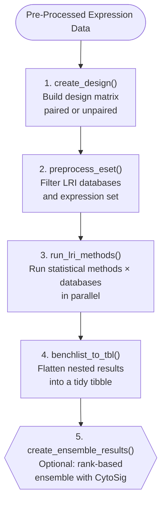

# cytokineFindeR

<!-- badges: start -->
[](https://codecov.io/gh/CompBio-Lab/cytokineFindeR)
[](https://github.com/CompBio-Lab/cytokineFindeR/actions/workflows/R-CMD-check.yaml)
[](https://www.gnu.org/licenses/gpl-3.0)
<!-- [](https://bioconductor.org/checkResults/devel/bioc-LATEST/cytokineFindeR) -->
<!-- badges: end -->

## Overview

**cytokineFindeR** is an R package for measuring and ranking cytokines and other signaling ligands across multiple statistical methods and ligand-receptor interaction (LRI) databases. It uses receptor gene sets derived from curated LRI databases as proxies for upstream ligand activity - enabling transcriptomic inference of cytokine signaling without requiring direct cytokine measurements.

The package supports:

- **4 statistical methods**  linear models inferring cytokine activity based on LRI databases and a custom implementation of CytoSig, a ridge regression model trained on 20,591 transcriptomic profiles
- **Multiple curated LRI databases** (e.g., BaderLab, LIANA+, CellChatv2, Omnipath)
- **Rank-based ensemble scoring** combining LRI-based methods with CytoSig
- **Paired and unpaired experimental designs** with duplicate correlation support
- **Parallel execution** via `future` and `future.apply`

### Biological Use Case

Given a gene expression matrix (bulk RNA-seq or microarray) and sample group labels, cytokineFindeR infers which cytokines or ligands are most differentially active between conditions by testing whether their associated receptor gene sets are coordinately up- or down-regulated. Results from multiple methods and databases are aggregated to produce a robust, consensus ranking.

---

## Installation

### From Bioconductor (recommended)

```r
if (!require("BiocManager", quietly = TRUE))
    install.packages("BiocManager")

BiocManager::install("cytokineFindeR")
```

### Development version from GitHub

```r
# install.packages("devtools")
devtools::install_github("CompBio-Lab/cytokineFindeR", build_vignettes = TRUE)
```

---

## Quick Start

```r
library(cytokineFindeR)

# Load the included demo dataset (golimumab anti-TNF treatment, GSE92415)
data(golimumab)
data(dbs_cytosig)

eset      <- golimumab$qc_eset
treatment <- golimumab$cond
obs_id    <- golimumab$obs_id   # paired sample IDs

# Select databases (3 of the available curated LRI databases)
dbs <- dbs_cytosig[names(dbs_cytosig) %in% c("baderlab", "lianaplus", "cellchat")]

# Create design matrix (handles paired and unpaired designs)
design     <- create_design(treatment, obs_id, eset)
design_mat <- design$design
dupcor     <- design$dupcor

# Preprocess: filter databases and expression set for compatible features
preprocess <- preprocess_eset(eset, dbs)
eset_f     <- preprocess$eset_f
dbs_f      <- preprocess$dbs_f

# Run benchmarking across methods in parallel
methods <- c("gsva_limma", "pca_limma")

results <- run_lri_methods(
  eset        = eset_f,
  design      = design_mat,
  dbs         = dbs_f,
  methods     = methods,
  treatment   = treatment,
  obs_id      = obs_id,
  correlation = dupcor$consensus
)

# Flatten results into a tidy tibble
golimumab_treatment <- list(TNF = list(benchmarks = results))
tbl <- benchlist_to_tbl(results_list = golimumab_treatment,
                         study_type   = "treatment")
head(tbl)
```

---

## Core Workflow

The typical cytokineFindeR analysis follows five steps:



Alternatively, all steps (excluding CytoSig ensemble) can be run at once using:

```r
study_data <- list(qc_eset = eset, cond = treatment, obs_id = obs_id)

study_data <- run_cytokinefinder(
  study_data = study_data,
  databases  = dbs_f,
  methods    = c("gsva_limma", "pca_limma", "cfgsea")
)
```

---

## Statistical Methods

cytokineFindeR implements seven approaches for inferring ligand activity from receptor gene sets:

| Function | Method | Model Class | Output Metric |
|---|---|---|---|
| `gsva_limma` | GSVA + limma | Linear model | p-value, adjusted p-value, logFC |
| `pca_limma` | PCA (1st PC) + limma | Linear model | p-value, adjusted p-value, logFC |
| `cfgsea` | fGSEA on limma t-statistics | GSEA | p-value, NES |
| `cytosig_custom_ridge` | Ridge regression (CytoSig betas) | Ridge | Coefficient |

**Paired experimental designs** (pre/post or matched samples) are supported in all linear model methods via `obs_id` and duplicate correlation parameters from `limma::duplicateCorrelation`.

---

## LRI Databases

The package ships with four pre-curated dataset objects:

| Object | Description |
|---|---|
| `dbs_all` | Complete collection of LRI databases (all sources) |
| `dbs_subset` | Small subset for quick examples and testing |
| `dbs_cytosig` | LRI databases filtered to the CytoSig cytokine set |
| `cytosig_beta` | CytoSig beta coefficient matrix for ridge regression |

Each database object is a named list of lists, where the outer keys are database names (e.g., `"baderlab"`, `"lianaplus"`, `"cellchat"`) and the inner keys are ligand names mapped to vectors of receptor gene symbols.

Custom databases can be saved using:

```r
create_db_space(my_db_list, filePath = "data/my_lri_db.rda")
```

---

## Key Functions Reference

### Data Retrieval and Preparation

| Function | Description |
|---|---|
| `retrieve_geo(geo_id)` | Download and parse GEO datasets via GEOquery |
| `clean_eset(eset, gene_list_df)` | Standardize gene names (e.g., collapse probe IDs) |
| `create_design(treatment, obs_id, eset)` | Create design matrix; handles paired designs |
| `preprocess_eset(eset, dbs)` | Filter databases and expression matrix for compatibility |
| `create_db_space(...)` | Save curated LRI database objects to `.rda` |

### Analysis

| Function | Description |
|---|---|
| `run_lri_methods(eset, design, dbs, methods, ...)` | Run all specified methods × databases in parallel |
| `run_cytokinefinder(study_data, databases, methods)` | All-in-one wrapper for the full LRI benchmarking pipeline |
| `cytosig_custom_ridge(eset, design, ...)` | CytoSig ridge regression on limma logFC values |
| `run_limma(eset, design, ...)` | Standard limma differential expression analysis |

### Results Processing

| Function | Description |
|---|---|
| `benchlist_to_tbl(results_list, study_type, ...)` | Flatten nested benchmark results into a tidy tibble |
| `create_ensemble_results(master_tbl, ...)` | Rank-based ensemble combining LRI + CytoSig results |
| `extract_ligands(benchmark_results, ligands, metrics)` | Extract and rank specific ligands from results |
| `process_method_db(df, method_name, db_name, metrics)` | Process and rank a single method × database result table |
| `summarize_df(results_df, metric)` | Summarize results in long format sorted by rank |
| `reshape_metric(df, metric, type)` | Reshape results to long format for a given metric |

---

## Demo Dataset

The `golimumab` dataset is a pre-processed subset of [GSE92415](https://www.ncbi.nlm.nih.gov/geo/query/acc.cgi?acc=GSE92415) from GEO. It contains bulk RNA-seq data from ulcerative colitis patients treated with golimumab (an anti-TNF biologic), comparing gene expression at Week 0 vs. Week 6. It is provided as a named list with three elements:

- `qc_eset` - normalized gene expression matrix (genes × samples)
- `cond` - treatment condition vector (`"week0"` / `"week6"`)
- `obs_id` - subject IDs for paired sample matching

```r
data(golimumab)
str(golimumab)
```

---

## Vignettes

| Vignette | Description |
|---|---|
| `cytokineFindeR-introduction` | End-to-end walkthrough using the golimumab demo dataset |
| `benchmark_mapping` | Details on LRI database curation and CytoSig cytokine mapping |

```r
browseVignettes("cytokineFindeR")
```

---

## Dependencies

**cytokineFindeR** depends on the following Bioconductor and CRAN packages:

**Bioconductor:** `Biobase`, `limma`, `GSVA`, `fgsea`, `GEOquery`, `mixOmics`

**CRAN:** `dplyr`, `purrr`, `tibble`, `rlang`, `future`, `future.apply`

---

## Citation

If you use cytokineFindeR in your research, please cite:

> Tang J, Dhillon H, Singh A, Singh A. cytokineFindeR: an R-package for benchmarking methods and databases for identifying cytokines. R package version 0.99.0. bioRxiv. https://www.biorxiv.org/content/10.1101/2025.09.30.679635v1

---

## License

This package is licensed under the [GPL-3 License](LICENSE).

---

## Contributing

Bug reports and feature requests can be submitted via [GitHub Issues](https://github.com/CompBio-Lab/cytokineFindeR/issues).

---
